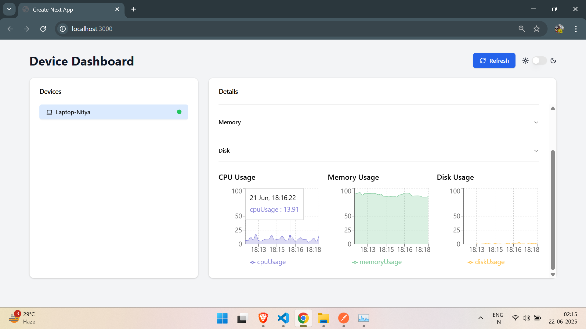

# 📡 Device Monitoring Dashboard

A full-stack real-time dashboard for monitoring multiple devices' **CPU**, **memory**, and **disk** usage — with a responsive UI, theme switching, historical charts, and modern design. Built with **Next.js** (React) and **FastAPI**, styled using **Tailwind CSS** and **ShadCN UI** components.

---

## 🚀 Features

- 📊 Real-time resource usage charts (CPU, Memory, Disk) via **Recharts**
- 💡 Dark/Light mode with localStorage persistence
- 🟢 Online/offline indicator with selected device highlighting
- 🎯 OS & Architecture shown as elegant **badges**
- 🔄 Auto refresh every 10 seconds + manual refresh
- 📱 Mobile-first responsive layout
- 🧩 Collapsible sections for General, CPU, Disk, and Memory
- ⚡ Smooth animations using **Framer Motion**

---

## 🧱 Tech Stack

- **Frontend:** Next.js 14+, TypeScript, Tailwind CSS
- **Charts & UI:** Recharts, ShadCN UI, Radix UI, Framer Motion
- **Backend:** FastAPI (Python), MongoDB
- **Data Flow:** REST APIs

---

## 📸 Preview

 <!-- Replace with your image -->

---

## 🛠️ Getting Started

### Prerequisites

- Node.js (v18+)
- Python 3.9+
- MongoDB (local or Atlas)

---

### 📦 Frontend Setup

```bash
# Clone the repo
git clone https://github.com/your-username/device-monitoring-dashboard.git
cd device-monitoring-dashboard

# Install frontend dependencies
npm install

# Start the frontend
npm run dev

---
```
### 🧠 Backend Setup

```bash
cd backend  # Adjust if you placed it elsewhere

# Create & activate virtual environment
python -m venv venv
source venv/bin/activate  # Windows: venv\Scripts\activate

# Install dependencies
pip install -r requirements.txt

# Run FastAPI server
uvicorn main:app --reload
```

---

## 🌐 API Endpoints

| Endpoint                         | Description                    |
| -------------------------------- | ------------------------------ |
| `GET /api/devices/logs?userId=x` | Fetch real-time usage logs     |
| `GET /api/devices`               | Get registered device metadata |
| `GET /api/usage`                 | Get most recent usage snapshot |

---

## 📂 Project Structure

```
device-monitoring-dashboard/
├── components/            # Shared UI components
├── pages/
│   └── index.tsx          # Dashboard entry
├── hooks/
│   └── use-toast.ts       # Custom toast hook
├── public/
│   └── screenshot.png     # Optional preview image
├── backend/
│   ├── main.py            # FastAPI entrypoint
│   ├── routes/            # API routes
│   └── models/            # Data models
```
